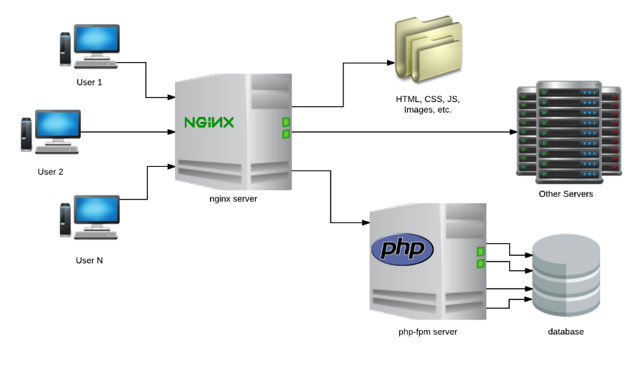
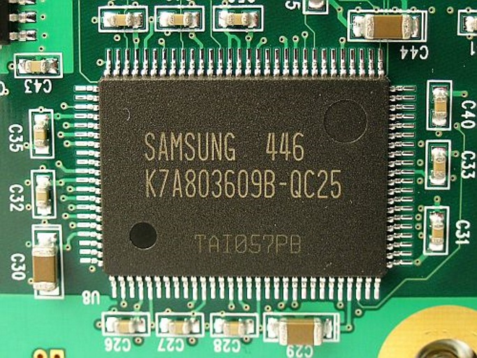

<!-- $size: a4 -->

Microcaché de nginx para php-fpm
===

###### Por Aldo Fregoso ( [@aldo_mx](https://twitter.com/Aldo_MX) )


---

# Introducción

---

# Introducción

## ¿Qué pasa cuándo abro un sitio web?



---

# Introducción

## Ejemplo de Aplicación Web


---

# Introducción

## Ejemplo de Aplicación Web


---

# Introducción

## Mi sitio está lento, ¡Ayuda!

### Plan A - Mejorar la infraestructura


---

# Introducción

## Mi sitio está lento, ¡Ayuda!

### Plan B - Implementar Caché



---

# Introducción

## Diferentes tipos de Caché

- Hardware: L1, L2, L3, ..., RAM, Swap
- Integrado en aplicaciones: MySQL, Nginx, ...
- Ad-hoc: Archivos, Redis, Memcached, ...
- Proxy: Varnish, Cloudflare, ...
- Browser

---

# Microcache de Nginx

---

# Microcache de Nginx

## Inicializando el microcaché

```
# nginx.conf

http {
    ...

    # Linux / macOS
    fastcgi_cache_path /var/cache/nginx levels=1:2 ↩
keys_zone=microcache_id:128m;

    # Windows
    fastcgi_cache_path C:/nginx/cache levels=1:2 ↩
keys_zone=microcache_id:128m;

    ...
}
```

---

# Microcache de Nginx

## fastcgi_cache_path `path` `levels` `keys_zone`

- `path` - directorio
- `levels=<levels>` - jerarquía de directorios
- `keys_zone=<id>:<size>` - ID y tamaño de la zona compartida de memoria.

Ejemplo de `levels=1:2`:

```text
6446641fb3e815a159ae9bb75b02d05d ->
    /cache/d/05/6446641fb3e815a159ae9bb75b02d05d
```

---

# Microcache de Nginx

## Habilitando el microcaché

```
# your-website.conf

server {
    ...

    location ~ \.php$ {
        ...
        fastcgi_cache          microcache_id;
        fastcgi_cache_valid    60s;
        include                fastcgi-microcache.conf;
    }
}
```

---

# Microcache de Nginx

## Parámetros generales

```
# fastcgi-microcache.conf

set $cache_bypass "0";

# Skip cache for request methods different than GET and HEAD
if ($request_method !~ ^(GET|HEAD)$) {
    set $cache_bypass "1";
}

fastcgi_no_cache        $cache_bypass;
fastcgi_cache_bypass    $cache_bypass;

fastcgi_cache_key       "$scheme$request_method$host$request_uri";
fastcgi_cache_use_stale updating;
```

---

# Microcache de Nginx

## Parámetros generales

- **fastcgi_no_cache** - 0 para crear caché, 1 para no crearlo
- **fastcgi_cache_bypass** - 0 para leer caché, 1 para omitirlo
- **fastcgi_cache_key** - Llave que será hasheada, ej. `httpGETexample.com/phpinfo.php`
- **fastcgi_cache_use_stale** - Cuándo utilizar un cache obsoleto (ej. `error`, `timeout`, `updating`, ...)

---

# Microcache de Nginx

## Demostración

---

# Microcache de Nginx

## Links de interés

- Documentación oficial
  http://nginx.org/en/docs/http/ngx_http_fastcgi_module.html
- Libro Instant Nginx Starter
  https://www.packtpub.com/networking-and-servers/instant-nginx-starter
- Chat de PHP México
  http://chat.phpmexico.mx/
- Marp (Diapositivas en Markdown)
  https://yhatt.github.io/marp/

---

# Microcache de Nginx

## Preguntas y Respuestas

Descarga ésta presentación y el material de apoyo de:
https://github.com/AldoMX/phpmx-nginx-microcache/


